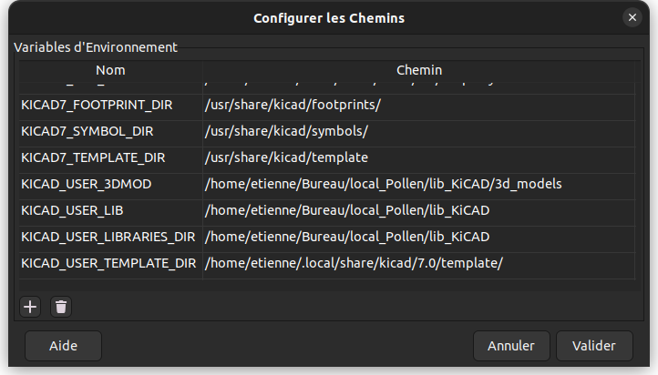

# KiCAD libraries

## Basically
 - Symbols
 - Footprints
 - 3d Models

## User Paths Configuration
 - KICAD_USER_3DMOD
 - KICAD_USER_LIB
 - KICAD_USER_LIBRARIES_DIR

## User Symbols path
Lib_Pollen --- ${KICAD_USER_LIB}/Symbols/Library_Pollen.kicad_sym

## User Footprints path
Lib_Pollen --- ${KICAD_USER_LIB}/Footprints/Lib_Pollen.pretty

